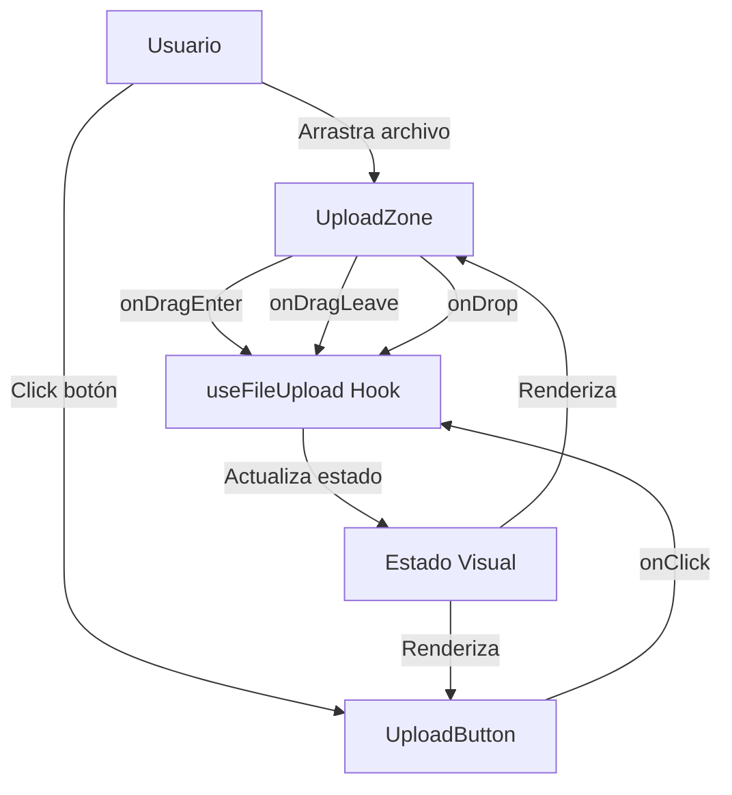
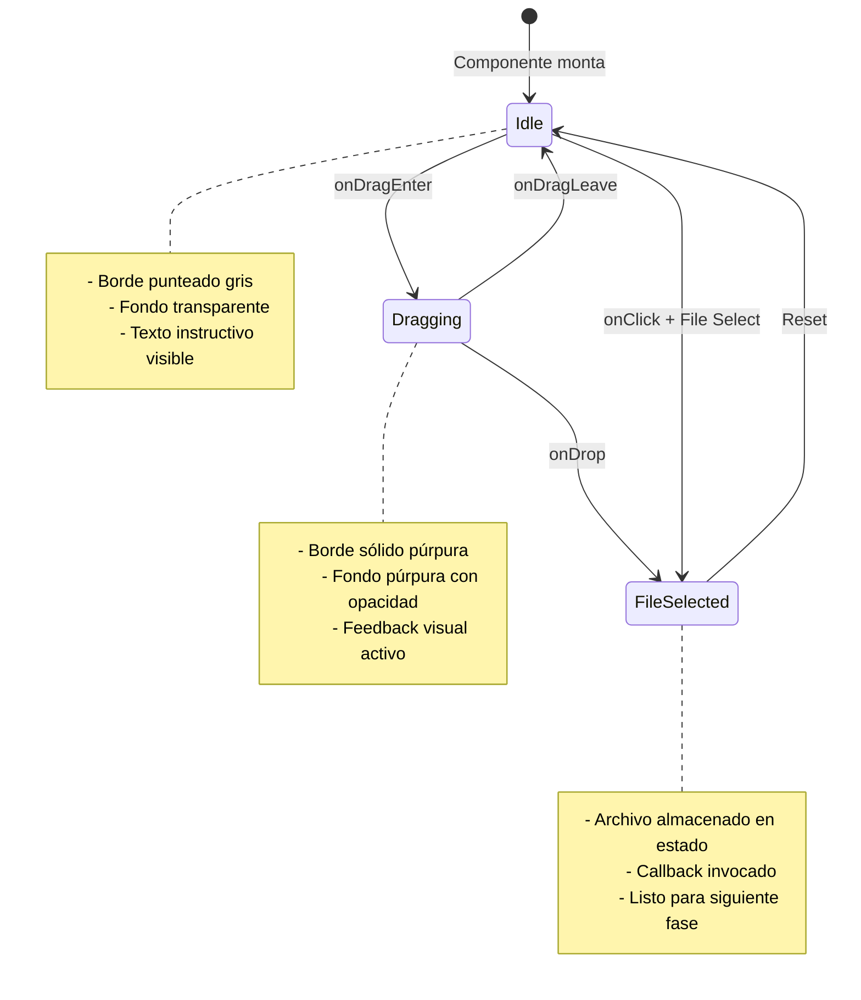
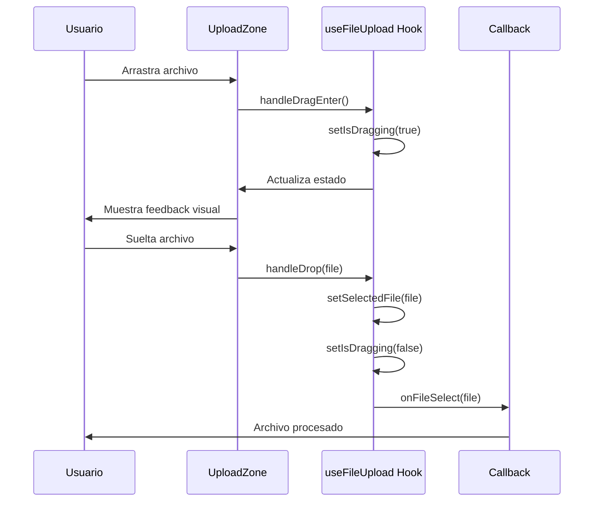

# Documento de Diseño

## Visión General

La interfaz de carga de imágenes es el punto de entrada principal de la aplicación Resize Images. Proporciona una experiencia moderna y minimalista que permite a los usuarios cargar imágenes mediante dos métodos: arrastrar y soltar, o selección tradicional mediante botón. El diseño prioriza la claridad visual, el feedback inmediato y la accesibilidad, siguiendo estrictamente la paleta de colores y principios de diseño establecidos para el proyecto.

Esta implementación se enfoca exclusivamente en la presentación visual y la experiencia de usuario, sin incluir lógica de procesamiento de imágenes en esta fase.

## Arquitectura

### Estructura de Componentes

La arquitectura sigue el patrón de composición de React con separación clara entre componentes de presentación y lógica de estado:

```
app/
  page.tsx                          # Página principal (Server Component)
  
components/
  ImageUploader/
    index.tsx                       # Componente principal (Client Component)
    UploadZone.tsx                  # Zona de arrastre visual
    UploadButton.tsx                # Botón de carga
    UploadIcon.tsx                  # Ícono visual
    types.ts                        # Tipos TypeScript
    useFileUpload.ts                # Hook personalizado para lógica de carga

locales/
  en.json                           # Traducciones en inglés
  es.json                           # Traducciones en español

lib/
  i18n.ts                           # Utilidades de internacionalización
```

### Flujo de Datos



### Decisiones Arquitectónicas

1. **Client Component para interactividad**: El componente `ImageUploader` debe ser un Client Component (`'use client'`) porque requiere hooks de estado y event handlers del navegador
2. **Custom Hook para lógica**: La lógica de manejo de archivos y estados se extrae a `useFileUpload` para mantener los componentes de presentación limpios
3. **Composición sobre monolitos**: Dividir en subcomponentes pequeños (`UploadZone`, `UploadButton`, `UploadIcon`) facilita el mantenimiento y testing
4. **Internacionalización basada en archivos JSON**: Las traducciones se mantienen en archivos JSON separados (en.json, es.json) para facilitar la gestión y escalabilidad
5. **Detección automática de idioma**: El idioma se detecta automáticamente desde el navegador del usuario, con fallback a inglés

## Componentes e Interfaces

### ImageUploader (Componente Principal)

Componente contenedor que orquesta la funcionalidad de carga.

```typescript
interface ImageUploaderProps {
  onFileSelect?: (file: File) => void;
  className?: string;
}
```

**Responsabilidades:**
- Coordinar subcomponentes
- Gestionar estado mediante `useFileUpload` hook
- Proporcionar contexto visual general

### UploadZone (Zona de Arrastre)

Componente de presentación que renderiza el área de arrastre y soltar.

```typescript
interface UploadZoneProps {
  isDragging: boolean;
  onDragEnter: (e: React.DragEvent) => void;
  onDragLeave: (e: React.DragEvent) => void;
  onDragOver: (e: React.DragEvent) => void;
  onDrop: (e: React.DragEvent) => void;
  children: React.ReactNode;
}
```

**Estados Visuales:**
- **Inactivo**: Borde punteado gris, fondo transparente
- **Arrastrando**: Borde sólido púrpura (#B13BFF), fondo con opacidad del color púrpura
- **Archivo recibido**: Transición suave con feedback visual

### UploadButton (Botón de Carga)

Botón que activa el selector de archivos nativo.

```typescript
interface UploadButtonProps {
  onClick: () => void;
  disabled?: boolean;
}
```

**Características:**
- Color primario: #B13BFF
- Hover: #471396
- Tamaño mínimo táctil: 44x44px
- Transición suave en hover (200ms)

### UploadIcon (Ícono Visual)

Componente SVG que muestra un ícono representativo de carga.

```typescript
interface UploadIconProps {
  className?: string;
  size?: number;
}
```

**Especificaciones:**
- Ícono de nube con flecha hacia arriba
- Color adaptable según estado
- Tamaño por defecto: 64px

### useFileUpload (Custom Hook)

Hook que encapsula la lógica de manejo de archivos y estados.

```typescript
interface UseFileUploadReturn {
  isDragging: boolean;
  selectedFile: File | null;
  handleDragEnter: (e: React.DragEvent) => void;
  handleDragLeave: (e: React.DragEvent) => void;
  handleDragOver: (e: React.DragEvent) => void;
  handleDrop: (e: React.DragEvent) => void;
  handleFileSelect: (e: React.ChangeEvent<HTMLInputElement>) => void;
  triggerFileInput: () => void;
  fileInputRef: React.RefObject<HTMLInputElement>;
}
```

## Modelos de Datos

### FileUploadState

```typescript
interface FileUploadState {
  isDragging: boolean;
  selectedFile: File | null;
  error: string | null;
}
```

### UploadConfig

```typescript
interface UploadConfig {
  acceptedFormats: string[];
  maxFileSize: number;
  multiple: boolean;
}

const DEFAULT_CONFIG: UploadConfig = {
  acceptedFormats: ['image/jpeg', 'image/png', 'image/webp', 'image/gif'],
  maxFileSize: 10 * 1024 * 1024, // 10MB
  multiple: false
};
```

### Translations (Internacionalización)

```typescript
interface Translations {
  uploadZone: {
    title: string;
    description: string;
    dragActive: string;
  };
  uploadButton: {
    label: string;
    ariaLabel: string;
  };
  errors: {
    invalidFormat: string;
    fileTooLarge: string;
    multipleFiles: string;
  };
}

type SupportedLocale = 'en' | 'es';
```

**Estructura de archivos JSON**:

`locales/en.json`:
```json
{
  "uploadZone": {
    "title": "Upload Image",
    "description": "Drag and drop an image here, or click to select",
    "dragActive": "Drop the image here"
  },
  "uploadButton": {
    "label": "Select Image",
    "ariaLabel": "Select image from your device"
  },
  "errors": {
    "invalidFormat": "Invalid file format. Please upload a JPEG, PNG, WebP, or GIF image.",
    "fileTooLarge": "File is too large. Maximum size is 10MB.",
    "multipleFiles": "Please upload only one image at a time."
  }
}
```

`locales/es.json`:
```json
{
  "uploadZone": {
    "title": "Subir Imagen",
    "description": "Arrastra y suelta una imagen aquí, o haz clic para seleccionar",
    "dragActive": "Suelta la imagen aquí"
  },
  "uploadButton": {
    "label": "Seleccionar Imagen",
    "ariaLabel": "Seleccionar imagen desde tu dispositivo"
  },
  "errors": {
    "invalidFormat": "Formato de archivo inválido. Por favor sube una imagen JPEG, PNG, WebP o GIF.",
    "fileTooLarge": "El archivo es demasiado grande. El tamaño máximo es 10MB.",
    "multipleFiles": "Por favor sube solo una imagen a la vez."
  }
}
```

## Propiedades de Corrección

*Una propiedad es una característica o comportamiento que debe mantenerse verdadero en todas las ejecuciones válidas del sistema - esencialmente, una declaración formal sobre lo que el sistema debe hacer. Las propiedades sirven como puente entre las especificaciones legibles por humanos y las garantías de corrección verificables por máquina.*


### Reflexión sobre Propiedades

Después de analizar todos los criterios de aceptación, identifico las siguientes redundancias y consolidaciones:

**Redundancias identificadas:**
- Los criterios 1.3 y 2.3 ambos verifican que se muestra feedback cuando un archivo es recibido, solo difieren en el método (arrastrar vs botón). Estos pueden consolidarse en una sola propiedad sobre actualización de estado al recibir archivos.
- Los criterios 4.1, 4.2, 4.3 son todos ejemplos específicos de diseño responsive que pueden verificarse juntos en un solo test de ejemplo.
- Los criterios 5.1 y 5.2 ambos verifican uso correcto de colores de la paleta y pueden consolidarse.

**Propiedades a mantener:**
- Propiedades sobre cambios de estado (isDragging, archivo seleccionado)
- Propiedades sobre comportamiento de eventos (drag enter/leave, click)
- Ejemplos de estado inicial y renderizado
- Ejemplos de accesibilidad

### Propiedades de Corrección

Property 1: Cambio de estado al arrastrar
*Para cualquier* evento de arrastre sobre la zona de carga, el estado isDragging debe cambiar a true y las clases CSS de feedback visual deben aplicarse
**Valida: Requisitos 1.2, 3.2**

Property 2: Restauración de estado al salir
*Para cualquier* evento de salida de arrastre, el estado isDragging debe volver a false y las clases CSS deben restaurarse al estado original
**Valida: Requisitos 1.4**

Property 3: Actualización de estado al recibir archivo
*Para cualquier* archivo válido recibido (mediante arrastre o selección), el estado selectedFile debe actualizarse con el archivo y el callback onFileSelect debe invocarse
**Valida: Requisitos 1.3, 2.3**

Property 4: Activación del selector de archivos
*Para cualquier* evento de click en el botón de carga, el input file nativo debe activarse mediante la referencia
**Valida: Requisitos 2.2**

Property 5: Aplicación de estilos hover
*Para cualquier* interacción hover con el botón de carga, las clases CSS de hover con color secundario deben aplicarse
**Valida: Requisitos 3.4**

Property 6: Indicador de foco visible
*Para cualquier* evento de foco en el botón de carga mediante teclado, las clases CSS de focus deben estar presentes y visibles
**Valida: Requisitos 6.1**

Property 7: Activación por teclado
*Para cualquier* evento de tecla Enter o Espacio cuando el botón tiene foco, el selector de archivos debe activarse
**Valida: Requisitos 6.4**

Property 8: Carga de traducciones correctas
*Para cualquier* idioma soportado (en, es), el sistema debe cargar el archivo de traducción correspondiente y mostrar los textos en ese idioma
**Valida: Requisitos 7.2, 7.3, 7.4**

## Manejo de Errores

### Estrategia de Manejo de Errores

Dado que esta fase se enfoca en la presentación visual sin lógica de procesamiento, el manejo de errores es mínimo:

1. **Prevención de comportamiento por defecto**: Prevenir el comportamiento por defecto del navegador en eventos de arrastre para evitar que el navegador abra el archivo
2. **Validación de tipos**: Aunque no se procesa el archivo, se puede verificar que sea un tipo de imagen válido para feedback futuro
3. **Estado de error**: Preparar la estructura para manejar errores en fases futuras (archivo muy grande, formato no soportado)

### Casos de Error Potenciales

```typescript
enum UploadErrorType {
  INVALID_FORMAT = 'INVALID_FORMAT',
  FILE_TOO_LARGE = 'FILE_TOO_LARGE',
  MULTIPLE_FILES = 'MULTIPLE_FILES'
}

interface UploadError {
  type: UploadErrorType;
  message: string;
}
```

**Nota**: En esta fase, estos errores no se implementan completamente, solo se define la estructura para futuras iteraciones.

## Estrategia de Testing

### Enfoque Dual de Testing

Esta implementación utilizará tanto unit tests como property-based tests para garantizar corrección y cobertura completa:

- **Unit tests**: Verificarán ejemplos específicos, casos de estado inicial, y configuraciones de accesibilidad
- **Property tests**: Verificarán comportamientos universales que deben mantenerse para cualquier entrada válida

### Unit Testing

**Framework**: Jest con React Testing Library

**Casos a cubrir**:
- Renderizado inicial con todos los elementos presentes (zona de arrastre, botón, ícono, texto)
- Dimensiones responsive correctas en diferentes breakpoints
- Aplicación correcta de colores de la paleta
- Presencia de atributos de accesibilidad (aria-labels, roles)
- Tamaños de fuente mínimos en móvil

**Ejemplo de test**:
```typescript
describe('ImageUploader - Initial State', () => {
  it('should render upload zone with instructional text', () => {
    render(<ImageUploader />);
    expect(screen.getByText(/arrastra.*imagen/i)).toBeInTheDocument();
    expect(screen.getByRole('button')).toBeInTheDocument();
  });
});
```

### Property-Based Testing

**Framework**: fast-check (biblioteca de property-based testing para TypeScript/JavaScript)

**Configuración**: Mínimo 100 iteraciones por propiedad

**Propiedades a implementar**:

1. **Property 1**: Cambio de estado al arrastrar - verificar que cualquier evento de drag enter activa el estado
2. **Property 2**: Restauración de estado - verificar que cualquier evento de drag leave restaura el estado
3. **Property 3**: Actualización de archivo - verificar que cualquier archivo válido actualiza el estado correctamente
4. **Property 4**: Activación de input - verificar que cualquier click activa el input file
5. **Property 5**: Estilos hover - verificar que las clases hover se aplican correctamente
6. **Property 6**: Foco visible - verificar que el foco es visible en el botón
7. **Property 7**: Activación por teclado - verificar que Enter/Espacio activan el selector

**Ejemplo de property test**:
```typescript
describe('ImageUploader - Properties', () => {
  it('Property 1: Drag enter always activates dragging state', () => {
    fc.assert(
      fc.property(fc.anything(), () => {
        const { result } = renderHook(() => useFileUpload());
        const mockEvent = createMockDragEvent();
        
        act(() => {
          result.current.handleDragEnter(mockEvent);
        });
        
        expect(result.current.isDragging).toBe(true);
      }),
      { numRuns: 100 }
    );
  });
});
```

**Anotación de tests**: Cada property-based test debe incluir un comentario que referencie explícitamente la propiedad del documento de diseño:

```typescript
/**
 * Feature: image-upload-interface, Property 1: Cambio de estado al arrastrar
 * Valida: Requisitos 1.2, 3.2
 */
```

### Tests de Integración

Aunque el foco es en unit y property tests, se recomienda un test de integración básico que verifique el flujo completo:

1. Usuario ve la interfaz inicial
2. Usuario arrastra un archivo
3. Estado visual cambia
4. Usuario suelta el archivo
5. Callback se invoca con el archivo correcto

## Consideraciones de Implementación

### Tailwind CSS - Configuración de Colores

Extender `tailwind.config.ts` con los colores de la paleta:

```typescript
export default {
  theme: {
    extend: {
      colors: {
        'brand-dark': '#090040',
        'brand-purple': '#B13BFF',
        'brand-secondary': '#471396',
        'brand-accent': '#FFCC00',
      }
    }
  }
}
```

### Clases de Utilidad Comunes

```typescript
const uploadZoneClasses = {
  base: 'border-2 border-dashed rounded-lg transition-all duration-200 ease-in-out',
  inactive: 'border-gray-300 bg-transparent hover:border-brand-purple',
  active: 'border-brand-purple bg-brand-purple/10'
};

const buttonClasses = {
  base: 'min-h-11 px-6 py-3 rounded-lg font-medium transition-all duration-200',
  primary: 'bg-brand-purple text-white hover:bg-brand-secondary',
  focus: 'focus:outline-none focus:ring-2 focus:ring-brand-purple focus:ring-offset-2'
};
```

### Accesibilidad - Atributos Requeridos

```typescript
// Zona de arrastre
<div
  role="button"
  tabIndex={0}
  aria-label={t.uploadZone.description}
>

// Botón de carga
<button
  type="button"
  aria-label={t.uploadButton.ariaLabel}
>

// Input file (oculto)
<input
  type="file"
  accept="image/jpeg,image/png,image/webp,image/gif"
  aria-hidden="true"
  ref={fileInputRef}
/>
```

### Internacionalización - Utilidades

```typescript
// lib/i18n.ts
export function getBrowserLocale(): SupportedLocale {
  if (typeof window === 'undefined') return 'en';
  
  const browserLang = navigator.language.split('-')[0];
  return browserLang === 'es' ? 'es' : 'en';
}

export async function loadTranslations(locale: SupportedLocale): Promise<Translations> {
  const translations = await import(`@/locales/${locale}.json`);
  return translations.default;
}

// Hook personalizado
export function useTranslations() {
  const [locale, setLocale] = useState<SupportedLocale>('en');
  const [translations, setTranslations] = useState<Translations | null>(null);
  
  useEffect(() => {
    const detectedLocale = getBrowserLocale();
    setLocale(detectedLocale);
    
    loadTranslations(detectedLocale).then(setTranslations);
  }, []);
  
  return { locale, translations, setLocale };
}
```

### Responsive Design - Breakpoints

```typescript
// Móvil (por defecto)
<div className="min-h-[200px] p-4">

// Tablet y superior
<div className="min-h-[200px] md:min-h-[300px] p-4 md:p-8">

// Desktop
<div className="min-h-[200px] md:min-h-[300px] lg:min-h-[400px] p-4 md:p-8 lg:p-12">
```

## Diagramas

### Diagrama de Estados



### Diagrama de Interacción



## Próximos Pasos

Esta fase establece la base visual y de interacción. Las siguientes fases incluirán:

1. **Validación de archivos**: Verificar formato, tamaño y tipo de imagen
2. **Preview de imagen**: Mostrar la imagen cargada antes de procesarla
3. **Integración con procesamiento**: Conectar con la lógica de redimensionamiento
4. **Manejo de errores completo**: Implementar mensajes de error y recuperación
5. **Optimización de rendimiento**: Lazy loading, memoización, y optimización de re-renders
